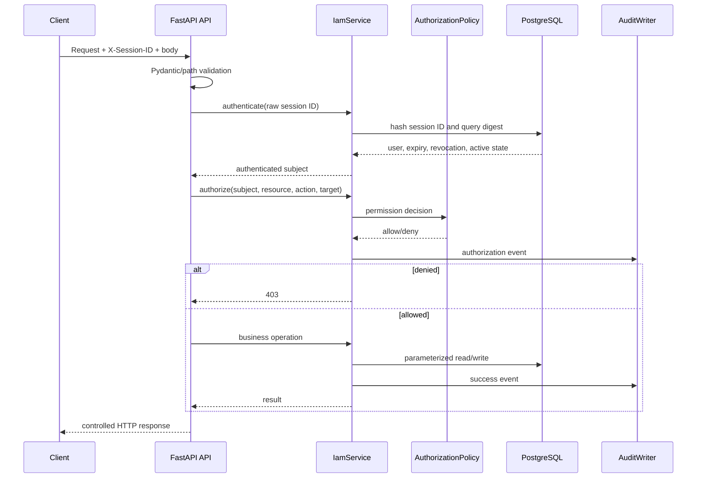
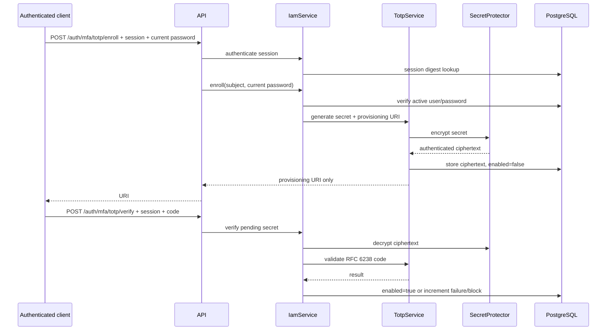

# IAM Platform Data Flows

## 1. Data classification

| Data | Classification | Storage/handling |
| --- | --- | --- |
| Password plaintext | Secret | Exists only transiently during request; never stored/logged. |
| Password hash | Credential verifier | `users.password_hash`; Argon2id for new hashes. |
| Raw session ID | Bearer secret | Login response/browser memory; sent in `X-Session-ID`; never stored. |
| Session hash | Sensitive security state | `sessions.id_hash`; SHA-256 digest. |
| TOTP secret | MFA secret | Encrypted Fernet ciphertext in `totp_mfa.encrypted_secret`; never returned after enrollment. |
| TOTP encryption key | Root secret | External `TOTP_ENCRYPTION_KEY`; never stored in DB. |
| Password reset token | One-time bearer secret | Raw delivery value is transient; SHA-256 digest stored in `password_reset_tokens.token_hash`. |
| OTP code | Transient authentication input | Compared in memory; never stored or audited. |
| Audit metadata | Security evidence | Server-generated, restricted to non-secret context. |

## 2. Standard protected request



## 3. Password login data flow

```text
username/password/totp_code
        |
        v
strict request model
        |
        v
user lookup by parameterized username
        |
        v
password hash verification
        |
        +--> invalid: bounded failure counter + generic 401
        |
        v
MFA state lookup
        |
        +--> disabled: issue random session ID
        |
        +--> enabled: decrypt TOTP secret -> verify code -> issue session ID
        |
        v
SHA-256(session ID)
        |
        v
sessions.id_hash + expiry stored
        |
        v
raw session ID returned once
```

No session row is created before MFA succeeds.

## 4. TOTP enrollment flow



## 5. Password reset flow

```text
email
  |
  v
request endpoint with generic 202 response
  |
  +--> known active account: random reset token -> SHA-256 digest in DB
  |
  +--> unknown account: no token, same response

external delivery integration (future)
  |
  v
raw reset token + new password
  |
  v
hash token -> lookup unused, unexpired digest
  |
  v
Argon2id password update + mark token used + revoke sessions
```

## 6. Audit data flow

Audit events are created by trusted service decisions, not by client-provided event fields. Typical metadata includes action names, relationship IDs, result state, and target identifiers. It excludes passwords, raw session IDs, password hashes, TOTP secrets, encryption keys, reset tokens, and OTP codes.

## 7. Database data flow

All external values are passed as SQL parameters. Dynamic update column lists are constructed only from fixed server-side field choices. PostgreSQL constraints enforce uniqueness, required values, foreign keys, primary keys, and cascades after application validation has run.
