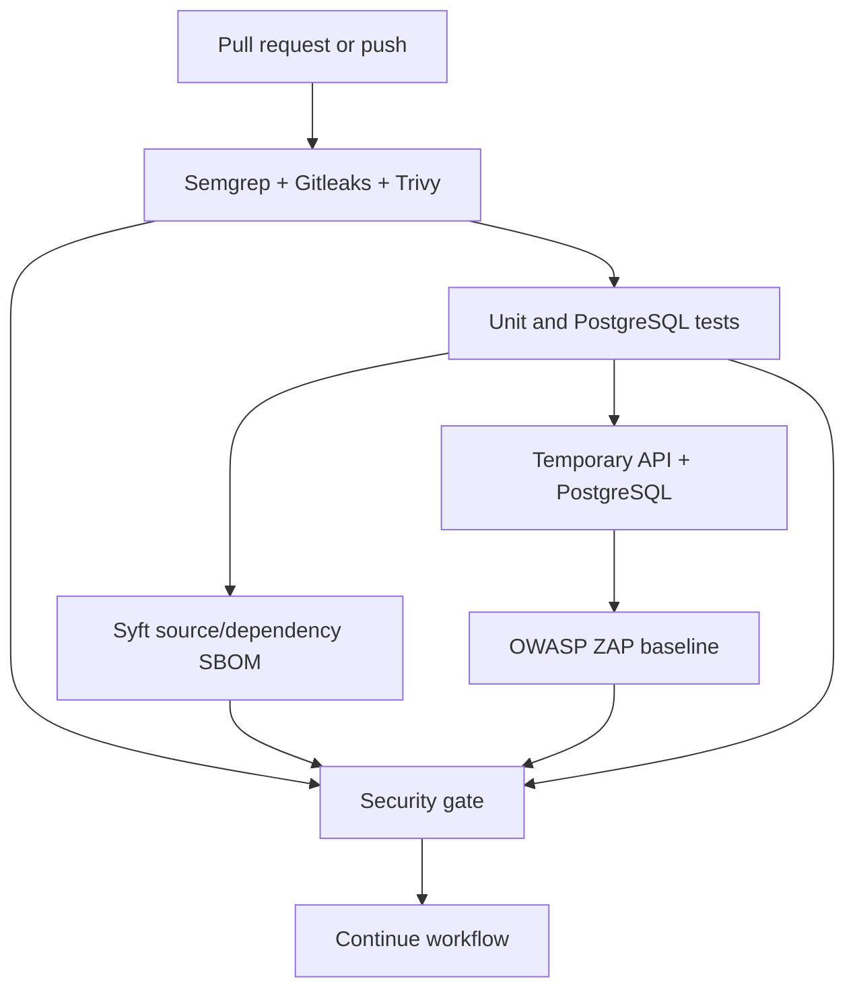

# DevSecOps Security Pipeline

The repository uses the GitHub Actions workflow at the repository-root path
`.github/workflows/security.yml`. The application itself lives in the `iam-platform/` subdirectory.
The workflow is named `DevSecOps Security - iam-platform`, and its path filters cause it to run
on pull requests, on pushes to `main` or `dev`, and on manual `workflow_dispatch` runs. Pull
request and push path filters require `iam-platform/**` or this workflow to change. It uses
temporary CI credentials and
temporary PostgreSQL services; it never targets production systems.

This document explains what happens from trigger to gate, why each tool is present, what files and
network targets each job can access, and how to reproduce the checks locally.

## Repository layout

```text
repository root/
|-- .github/workflows/security.yml    CI entry point discovered by GitHub
|-- iam-platform/
|   |-- app/                          FastAPI application and IAM service
|   |-- tests/                        Unit and PostgreSQL integration tests
|   |-- requirements.txt              Python dependency manifest
|   |-- docker-compose.yml            Local PostgreSQL configuration
|   `-- docs/                         Security and architecture documentation
`-- coding_principles.md
```

The workflow is deliberately stored at the repository root. GitHub Actions does not discover a
workflow placed under `iam-platform/.github/workflows/` when the Git root is the parent directory.

## Controls

| Security control | Tool | Target | Stage | Blocking policy |
| --- | --- | --- | --- | --- |
| SAST | Semgrep Community Edition | Python source | PR and push | Findings fail the Semgrep job |
| Secret scanning | Gitleaks | `iam-platform/` history and working tree | PR and push | Confirmed findings fail the job |
| SCA and IaC | Trivy | `iam-platform/requirements.txt`, repository configuration, and `docker-compose.yml` | PR and push | High and Critical findings fail the job |
| Application tests | Pytest | Unit and PostgreSQL integration behavior | PR and push | Any test failure fails the gate |
| SBOM | Syft | Checked-out source and dependency manifests | PR and push | SBOM generation must succeed |
| DAST | OWASP ZAP baseline | Temporary unauthenticated API on `127.0.0.1:8002` | PR and push | High and Critical ZAP alerts fail the job |
| Container scan | Trivy | Not run | Not applicable | No application Dockerfile or application image exists |

## Pipeline flow



The jobs run independently after checkout. The final `security-gate` job waits for every scanner,
test, SBOM, and DAST job, including jobs that fail, so reports can still be uploaded before the
gate evaluates their results.

## Trigger and runner setup

1. A pull request event or a push to `main` starts the workflow.
2. The path filters prevent unrelated systems from starting this workflow. A future system can
    add a separate root workflow with its own path filter and job configuration.
3. GitHub creates an isolated Ubuntu 24.04 runner for each job. Jobs do not share processes,
    databases, working directories, or generated reports.
4. `actions/checkout@v4.2.2` checks out the repository. The Gitleaks job uses `fetch-depth: 0`
    because secret detection should include repository history; the other jobs only need the current
    checkout.
5. The workflow declares `permissions: contents: read`. It does not request write access to the
    repository, pull requests, packages, deployments, or secrets.
6. The concurrency group cancels an older run for the same branch or pull request when a newer
    commit arrives. This reduces duplicate scanner work without allowing two runs for different
    branches to cancel each other.

No production credentials, GitHub secrets, external database, or public application endpoint is
used by this workflow.

## Job-by-job behavior

### 1. Semgrep SAST

The `sast` job:

1. Checks out the source and installs Python 3.10 on the runner.
2. Installs the Semgrep Community Edition CLI with pip.
3. Changes into `iam-platform/`, so the scan targets the actual Python application rather than
    unrelated repository prose.
4. Runs the maintained registry rules `p/python` and `p/security-audit`.
5. Writes a machine-readable SARIF report to `iam-platform/semgrep.sarif`.
6. Uses `--error`, so Semgrep findings make the job fail.
7. Uploads the SARIF report as the `semgrep-report` artifact even when the scan fails.

The pipeline does not add a large custom Semgrep ruleset. Rule updates remain owned by the Semgrep
community registry.

### 2. Gitleaks secret scanning

The `secrets` job:

1. Checks out the complete Git history.
2. Mounts the checkout read/write into the pinned `zricethezav/gitleaks:v8.24.2` container at
    `/repo`.
3. Scans only `/repo/iam-platform` and its Git history with Gitleaks' built-in detectors.
4. Writes `gitleaks.sarif` in the workspace without printing secret values.
5. Uses exit code `1` for confirmed findings, which fails the job.
6. Uploads the report as `gitleaks-report` regardless of the scan result.

The repository does not add custom secret patterns. Local `.env` files and generated scanner
reports are ignored by Git, but a secret committed in history is still intended to be detected by
this job.

### 3. Trivy dependency and configuration scanning

The `trivy` job uses the pinned `aquasec/trivy:0.59.1` container directly. Using the container
avoids depending on a separate setup action and keeps the scanner version explicit:

1. Checks out the full repository.
2. Uses Trivy filesystem mode with both `vuln` and `misconfig` scanners.
3. Scans only `iam-platform/`, including Python dependencies declared by
    `iam-platform/requirements.txt` and supported configuration such as its PostgreSQL Docker
    Compose file.
4. Includes fixed and unfixed results because `ignore-unfixed` is false.
5. Requests only `HIGH` and `CRITICAL` results for the blocking scan.
6. Writes a SARIF report to the repository workspace as `trivy.sarif` and uploads it as
    `trivy-report`.

Trivy's vulnerability and misconfiguration databases provide the findings. The repository does
not maintain a hand-written CVE list.

### 4. Application tests with temporary PostgreSQL

The `tests` job validates both behavior and database compatibility:

1. GitHub starts a PostgreSQL 16 service container for this job only.
2. The service uses the non-production CI values `postgres`, `ci-postgres-password`, and `iam`.
3. The health check waits for `pg_isready` before the test command runs.
4. The job exposes a process-local `DATABASE_URL` and bootstrap administrator values. These are
    test data, not repository secrets.
5. Python dependencies are installed from `iam-platform/requirements.txt`.
6. `IAM_RUN_INTEGRATION_TESTS=true python -m pytest -q` runs all unit tests and PostgreSQL tests.
7. The integration fixture resets the temporary database schema before bootstrapping its test
    administrator, so data cannot persist between workflow runs.

Any unit failure, database failure, authentication failure, or integration security regression
fails the job.

### 5. Syft SBOM generation and Trivy CVE verification

The `sbom` job uses `anchore/syft:v1.18.1` followed by `aquasec/trivy:0.59.1`. Syft produces an
SPDX inventory and Trivy consumes that exact inventory for a second, explicit CVE check:

1. Checks out the repository.
2. Installs the dependencies from `requirements.txt` into the temporary
    `iam-platform/.ci-sbom-site` directory. This resolves the actual package versions that CI can
    install instead of treating the manifest as an empty source file.
3. Mounts the checkout into the Syft container as `/repo`.
4. Scans `/repo/iam-platform`, including the temporary installed Python package metadata and
    dependency manifests.
5. Writes an SPDX JSON document to `sbom.spdx.json`.
6. Runs `trivy sbom /repo/sbom.spdx.json` against the generated SPDX document.
7. Writes the SBOM vulnerability results to `sbom-trivy.sarif`.
8. Fails on High or Critical CVEs, including unfixed findings, and uploads both files as the
    `spdx-sbom-and-cve-report` artifact.

SBOM generation and SBOM scanning must both succeed. The output is a source/dependency inventory,
not an image SBOM, because this repository has no application Dockerfile or application image
build. The separate Trivy filesystem job remains useful because it also scans repository
configuration and IaC; the SBOM job verifies the package inventory produced by Syft itself.

This system currently has no `package.json`, so there are no npm packages to catalog. It also has
no application Dockerfile or container image, so OS packages cannot be represented in this SBOM.
OS package inventory requires scanning the actual runtime image with Syft and then passing that
image SBOM to Trivy. Adding a placeholder image would make the result misleading, so OS package
coverage remains pending until this sub-project has an application image.

### 6. OWASP ZAP baseline DAST

The `dast` job creates a temporary HTTP test environment:

1. GitHub starts a separate PostgreSQL 16 service container with non-production CI values.
2. Python dependencies are installed from `iam-platform/requirements.txt`.
3. `uvicorn app.main:app` starts the FastAPI application on `127.0.0.1:8002` from the
    `iam-platform/` directory.
4. The job polls `/health` for up to 30 attempts. If startup fails, it prints the temporary API
    log and fails before scanning.
5. The pinned `zaproxy/zap-stable:2.15.0` container scans only
    `http://127.0.0.1:8002` through Docker host networking.
6. The container runs as root with `/zap/wrk` as its working directory so the mounted GitHub
    workspace is writable. ZAP writes `zap.html` and `zap.json` into that workspace.
7. The job preserves ZAP's scanner exit status separately from the report policy, parses the JSON
    report, and fails if any alert has ZAP risk code `3` (High) or `4`
    (Critical). Lower-risk findings remain available in the report.
8. Both reports are uploaded as `zap-report`, including when the scan or gate fails.

This is an unauthenticated baseline scan. It covers public routes, the health endpoint, headers,
and externally observable API behavior, but it does not log in or exercise protected IAM routes.
The workflow does not add an authentication bypass merely to make DAST appear more complete.

### 7. Final security gate

The `security-gate` job has `if: always()` and depends on all six preceding jobs. It receives each
job result through environment variables and fails when any result is not `success`.

This means the gate blocks on:

- Any Semgrep finding or scanner setup failure.
- Any confirmed Gitleaks secret or scanner setup failure.
- Any Trivy High or Critical vulnerability/misconfiguration or scanner setup failure.
- Any failed unit or PostgreSQL integration test.
- Failure to generate the SBOM or scan it for CVEs.
- Any DAST job failure, including a High or Critical ZAP alert.

Reports are uploaded before the gate is evaluated, so a failed gate should still provide the
artifact needed to investigate the finding.

## Why these tools

- **Semgrep** uses maintained community rules for Python security patterns without adding a custom ruleset.
- **Gitleaks** detects high-confidence credentials and tokens using its maintained detector database.
- **Trivy** covers both Python dependency vulnerabilities and supported repository configuration/IaC findings.
- **Syft** creates an SPDX inventory that can be retained with the workflow run. It is a
    source/dependency SBOM because this repository does not build an application image.
- **OWASP ZAP** provides a free baseline scan of the actual FastAPI HTTP surface in a private, temporary CI environment.

## Running locally

Install the application dependencies first:

```powershell
Push-Location iam-platform
python -m pip install --requirement requirements.txt
Pop-Location
```

Run the application tests:

```powershell
Push-Location iam-platform
python -m pytest -q
Pop-Location
```

The scanner commands used by CI can be run locally when the corresponding tools are installed:

```powershell
semgrep scan --config p/python --config p/security-audit iam-platform --sarif --output semgrep.sarif --error
gitleaks detect --source . --report-format sarif --report-path gitleaks.sarif --no-banner --exit-code 1
trivy fs --scanners vuln,misconfig --severity HIGH,CRITICAL iam-platform
syft dir:iam-platform -o spdx-json=sbom.spdx.json
```

For DAST, start the API against a temporary local PostgreSQL instance, verify `/health`, and run the pinned ZAP container command from the workflow. Do not point ZAP at production.

## Reports and remediation

The workflow uploads Semgrep, Gitleaks, Trivy, Syft, and ZAP reports as GitHub Actions artifacts, including when a scanner fails. A developer should inspect the affected file, package, configuration item, or endpoint in the corresponding artifact and remediate the underlying issue rather than suppressing the finding.

The initial gate blocks:

- Confirmed Gitleaks secrets.
- Semgrep findings returned by the configured security rules.
- Trivy High or Critical vulnerability or misconfiguration findings, including unfixed findings.
- High or Critical ZAP alerts.
- Failed application tests or SBOM generation.

Medium, Low, and Informational findings are retained in reports unless a scanner classifies them into a blocking severity. Scanner setup or availability failures also block the gate because an incomplete scan is not evidence of a clean build.

## Applicability and limitations

This repository has no application Dockerfile, Kubernetes manifests, Terraform, or existing build artifact. Trivy therefore scans the Docker Compose configuration as repository configuration, but there is no application image to build or scan. The Syft output is consequently a source/dependency inventory, not an image SBOM. When an application image is introduced, add a pinned image build and a Trivy image scan before publishing it.

ZAP runs without authentication. It covers public endpoints and startup behavior, but does not exercise protected IAM workflows requiring a session. Creating a CI-only authentication bypass would invalidate the result, so authenticated DAST remains a follow-up integration concern.

The workflow uses read-only repository permissions, versioned actions/images, non-production CI credentials, and no commercial SaaS dependency.

The workflow validates successfully as YAML, and the application test suite has been run locally
with all 60 tests passing. Scanner execution depends on Docker or the corresponding local CLI and
on network access to download maintained rule and vulnerability databases. A clean local scan is
not a substitute for reviewing artifacts from the CI run.
